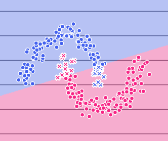
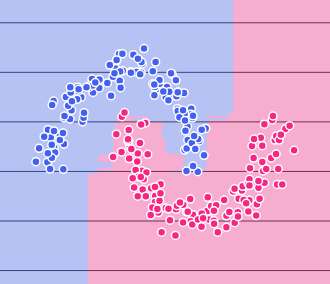
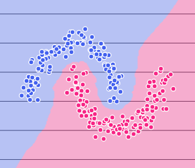
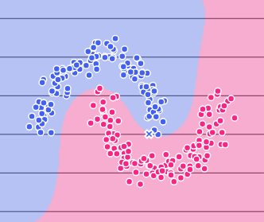
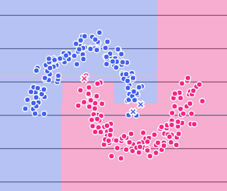

<div align="center">

# Machine Learning Playground

### *Experiment. Visualize. Understand.*

**An interactive, browser-ready tool for exploring machine learning classifiers — see decision boundaries form in real time, tune hyperparameters, and build intuition for how algorithms learn.**

<br>

[](https://www.python.org/)
[](https://streamlit.io/)
[](https://scikit-learn.org/)
[](./LICENSE)
[](./CONTRIBUTING.md)
[](https://github.com/yourusername/ml-playground/stargazers)

</div>

---
<div align="center">


*Selecting a dataset, switching between classifiers, and tuning hyperparameters in real time — the decision boundary updates with every change.*

</div>

---

## Overview

Machine Learning Playground is an **interactive educational tool** built with Streamlit that lets you experiment with over 10 classification algorithms without writing a single line of code.

Load a dataset, pick a classifier, adjust its hyperparameters with sliders, and watch the **decision boundary update instantly**. Whether you're a student building intuition for the first time or a practitioner sanity-checking a model, this playground gives you an immediate, visual feedback loop that textbooks and static notebooks simply can't match.

> *"The best way to understand an algorithm is to break it."*

---

## Features

- **10+ Classifiers** — Logistic Regression, K-Nearest Neighbors, Decision Trees, Random Forest, SVM (linear & RBF), Gradient Boosting, Naive Bayes, MLP Neural Network, AdaBoost, and more.
- **Real-Time Decision Boundary Visualization** — Watch boundaries redraw as you change parameters, giving immediate visual intuition.
- **Interactive Hyperparameter Tuning** — Sliders and dropdowns for every key parameter: `C`, `kernel`, `max_depth`, `n_neighbors`, and more.
- **Multiple Datasets** — Built-in toy datasets (Moons, Circles, Blobs, XOR) plus CSV upload support.
- **Overfitting & Underfitting Hints** — On-screen guidance flags when a model looks too simple or too complex for the data.
- **Performance Metrics** — Accuracy, precision, recall, F1, and a confusion matrix — all displayed alongside the plot.
- **Exportable Code** — Generate a ready-to-run Python snippet for any model configuration you build.
- **Dark Terminal UI** — A clean, distraction-free aesthetic designed for focused experimentation.

---

## Decision Boundary Visualizations

A picture is worth a thousand epochs. Here's how different classifiers carve up the same dataset:

<br>

<div align="center">

| Model | Visualization |
|:------|:-------------:|
| **Logistic Regression** — Clean linear boundary; fast and interpretable. |  |
| **Random Forest** — Jagged, ensemble-driven boundaries; high variance, high power. |  |
| **K-Nearest Neighbors (k=5)** — Highly local, non-parametric; sensitive to noise. |  |
| **SVM (RBF Kernel)** — Smooth, maximally-margined curves in high-dimensional space. |  |
| **Decision Tree** — Axis-aligned splits; perfectly interpretable, prone to overfitting. |  |

</div>

---

## Tech Stack

| Layer | Technology |
|:------|:-----------|
| **Framework** | [Streamlit](https://streamlit.io/) |
| **ML Models** | [scikit-learn](https://scikit-learn.org/) |
| **Numerical Computing** | [NumPy](https://numpy.org/) |
| **Visualization** | [Plotly](https://plotly.com/python/) |
| **Data Handling** | [Pandas](https://pandas.pydata.org/) |
| **Language** | [Python](https://python.org/) |

---

## Installation

**1. Clone the repository**

```bash
git clone https://github.com/yourusername/ml-playground.git
cd ml-playground
```

**2. Create and activate a virtual environment** *(recommended)*

```bash
python -m venv venv

# macOS / Linux
source venv/bin/activate

# Windows
venv\Scripts\activate
```

**3. Install dependencies**

```bash
pip install -r requirements.txt
```

**4. Launch the app**

```bash
streamlit run app.py
```

The app will open automatically at `http://localhost:8501`.

---

## Usage

Once the app is running:

1. **Select a Dataset** — Choose from built-in datasets (Moons, Circles, Blobs, XOR) or upload your own `.csv` file via the Dataset page.
2. **Pick a Classifier** — Navigate to the Model page and select an algorithm from the dropdown.
3. **Tune Hyperparameters** — Adjust parameters using the sidebar sliders. The decision boundary redraws in real time.
4. **Read the Hints** — Check the overfitting/underfitting indicator for guidance on whether your model needs more complexity or regularization.
5. **Export Your Code** — Hit **"Export Model Code"** to copy a Python snippet you can paste directly into your own project.

---

## Project Structure

```
ml-playground/
│
├── app.py                  # Entry point — Streamlit app config & global styles
│
├── pages/
│   ├── home.py             # Landing page with overview & quick-start guide
│   ├── dataset.py          # Dataset selection, upload, and preview
│   └── model.py            # Classifier selection, training, and visualization
│
├── assets/
│   ├── gallery/            # Static preview images for the home page gallery
│   ├── decision-boundary-*.png  # Decision boundary screenshots
│   └── tutorial.gif        # App walkthrough demo
│
├── utils/
│   ├── classifiers.py      # Classifier definitions and hyperparameter configs
│   ├── plotting.py         # Decision boundary and metrics plotting helpers
│   └── export.py           # Code export / snippet generation logic
│
├── .streamlit/
│   └── config.toml         # Streamlit theme configuration
│
├── requirements.txt
├── LICENSE
└── README.md
```

---

## Contributing

Contributions are welcome and appreciated. Here's how to get involved:

1. **Fork** the repository and create a new branch:
   ```bash
   git checkout -b feature/your-feature-name
   ```
2. **Make your changes** — keep commits focused and descriptive.
3. **Test** that the app runs cleanly with `streamlit run app.py`.
4. **Open a Pull Request** with a clear description of what you changed and why.

For larger changes or new feature ideas, please **open an issue first** to discuss the direction before investing time in implementation.

Please follow the existing code style and keep the educational focus of the project in mind. All contributions — bug fixes, new classifiers, UI improvements, docs — are equally valued.

---

## License

This project is licensed under the **MIT License** — see the [LICENSE](./LICENSE) file for details.

---

<div align="center">

Made with curiosity. If this helped you learn something, consider leaving a ⭐.

</div>